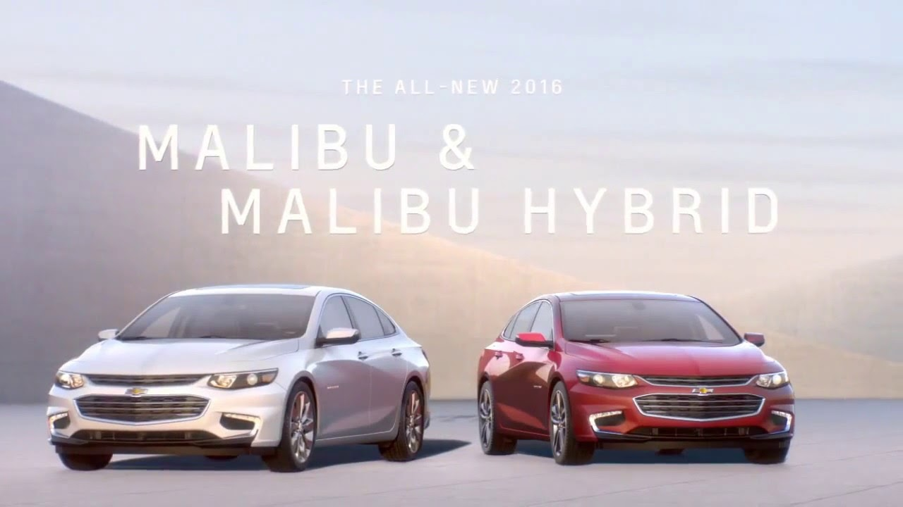
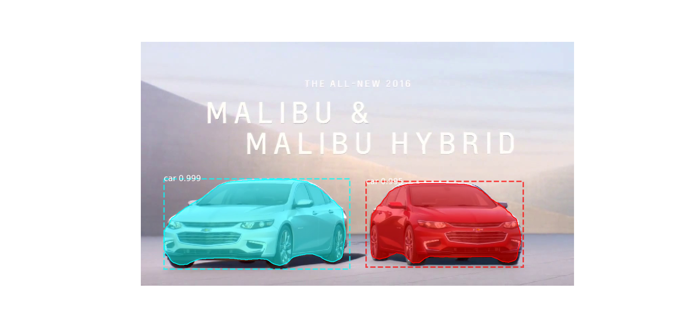
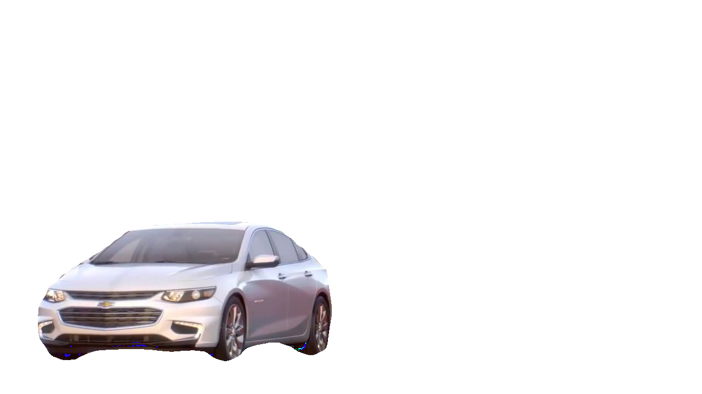
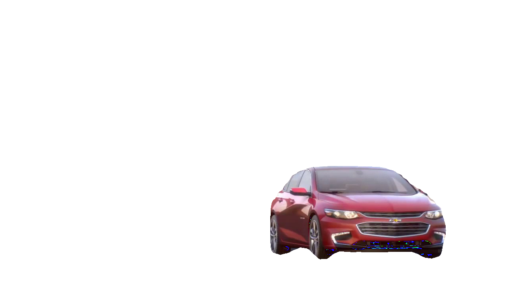
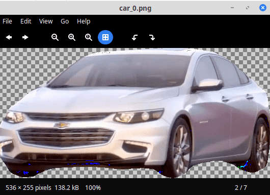
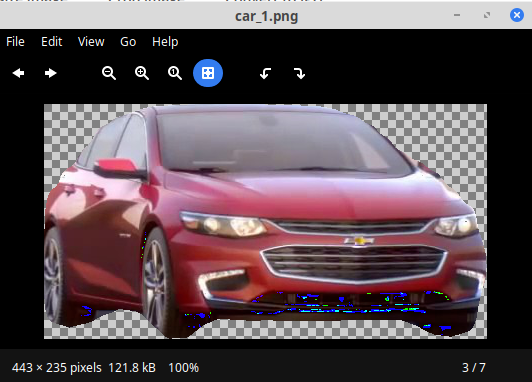
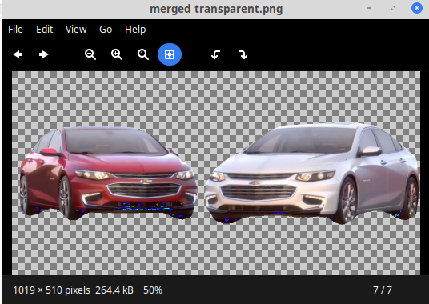
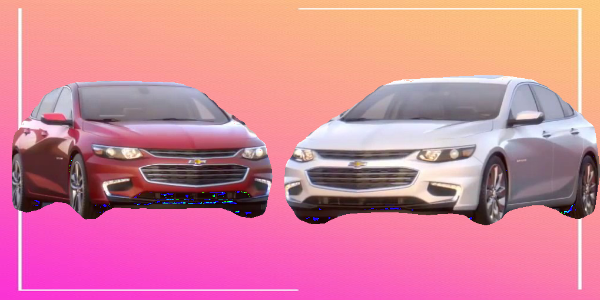
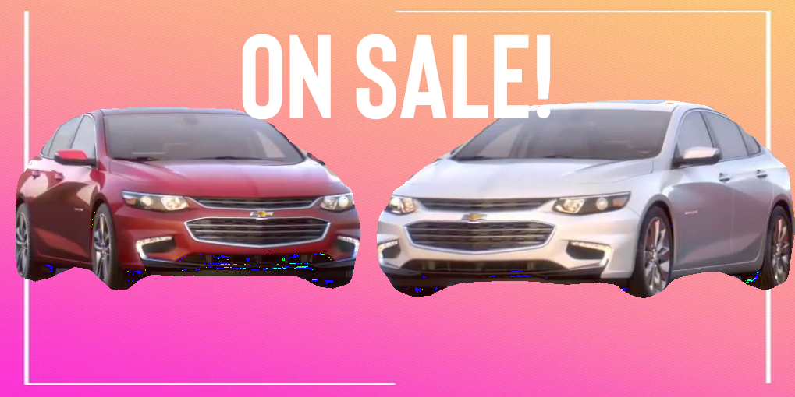

# INTELLIGENT ADVERTISEMENT GENERATION FOR E-COMMERCE WEBSITES.

Technology used : Image segmentation model built on top of Tensorflow Keras : [Mask RCNN](https://github.com/matterport/Mask_RCNN) and Python Image Processing. A website was built to demo the code using Python Flask.

## Create a virtual environment with the dependencies :
$ conda create --name <env> --file requirements.txt
  
There are other system dependent tools that need to be installed globally. That is beyond the scope of this README but active Googling will solve these extra dependencies.

## RUN THE WEBSITE
$ cd samples/api
$ python3 api.py

## USE THE CODE
The code is divided into two parts : pt1.py and pt2.py

- pt1.py (part 1) is the neural network part as all the images detected are extracted and saved in the *segmented_images* directory.

- pt2.py (part 2) is the image processing part. The segmented images are trimmed off their backgrounds, combined and added a common background. (Additional features include a custom text, adding stickers etc).

These files should be run in sequence as :
python3 pt1.py
python3 pt2.py

## UNDERSTANDING THE FLOW
### NEURAL NETWORKS (pt1.py)
#### Input Image :

Region Of Interest from the Mask RCNN Model :

#### Output from the model :
First Image                |  Second Image
:-------------------------:|:-------------------------:
|  

### IMAGE PROCESSING (pt2.py)

Transparent background and trimming the image :
- As images are an array of numbers, using the help of numpy module, the image background was converted to transparent background and stored as a png image
- ImageChops library was used to trim the transparent background to separate the image from the background.

First Image                |  Second Image
:-------------------------:|:-------------------------:
|  

#### Creating a new image

To merge the images, a new blank image was created whose dimensions were defined as follows:
- Width : Total width of the images plus (no of images*20 pixels). The width was defined so that each image could be placed at a distance of 20 pixels from each other for smooth viewing. 
- Height : 1.5 times the height of the longest image. The height was selected so as to add text to the top of the image at a later stage. 

#### Aligning the images

- Each image was iterated and pasted on to the new image leaving a width of 20 pixels between each image.
- While the images were being pasted, each image should be center vertically aligned. For that, the following formula was used :
y_offset = max_height//2 - heights[i]//2
- The transparent image was saved as output.

#### Adding a gradient background
- A gradient background was selected as the image background as was combined with the merged image using Python Image Library (PIL) 

#### Adding custom user text
- Through the web interface, a custom text was received from the user. 
- A function was written to create custom size of the font according to the amount of text and image size.
- The text was placed at the top center.

The entire code is open-sourced. Please feel free to open an Issue or a PR. Whatever works for you!
